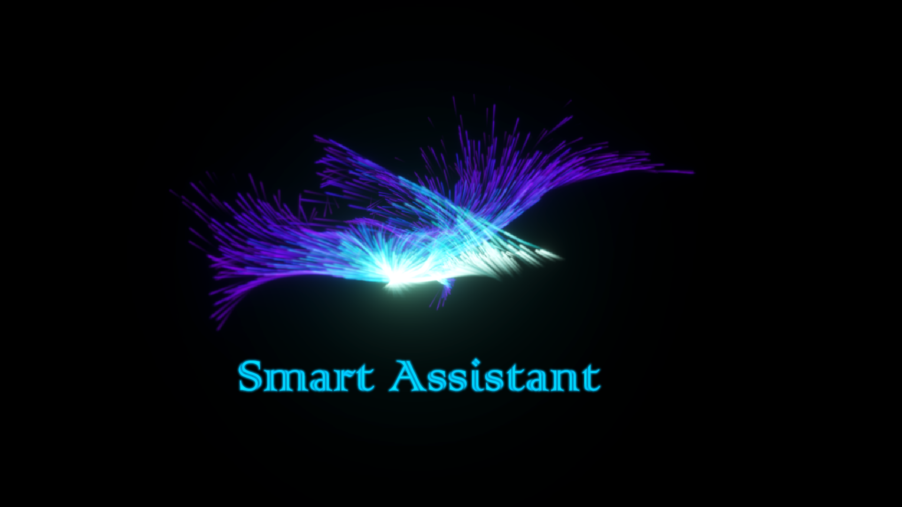
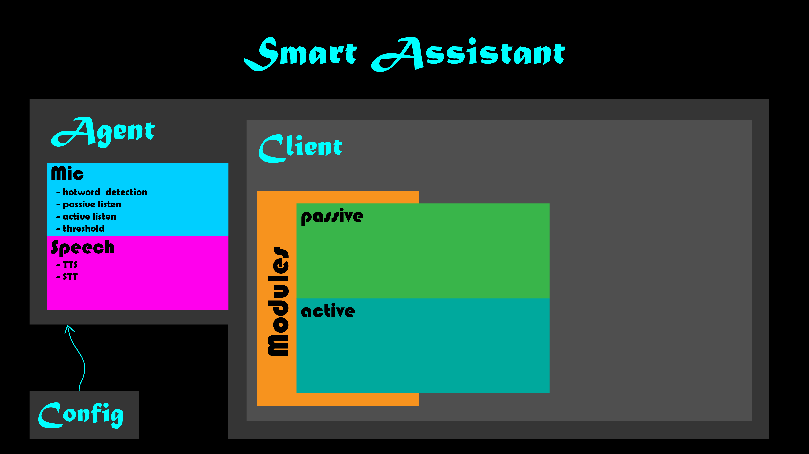

I have created a [playlist for this project.](https://www.youtube.com/watch?v=ncER2nHWTko&list=PLlnBGPe6GFdMxJwR8YXo_GfE1LtnTZfbk)

This is a basic overview of the Smart Assistant project:

## Smart Assistant
This is a fully functional smart assistant that is able to control your house and automate them. There are lots of features included in it.

Planned features:
- Chat with you
- Detect faces
- Recognize faces
- Remember things / Set alarms
- Sound recognition (able to differentiate several people's sound)
- Control devices via PLC, Raspberry Pi, Arduino (I/O, IR)
- More secure assistant that does not leak personal data

*We are adding more features!!!*

## Usage
Follow the steps below in order to use it:
1. Navigate into this directory and install the dependencies with `pip install -r requirements.txt`
2. Open `config.yml` and edit the settings inside it. (if you want to retrain a new hotword, make sure you change the `hotword_train_bypass` to `False`)
3. Now you can run the program with `python main.py`
4. Run the UI at `GUI/Build/Smart Assistant.exe`

Common Questions:
- Microsoft Visual C++ is required
Install Visual Studio Installer via this [link](https://aka.ms/vs/16/release/vs_buildtools.exe) and install C++ build tools.

- How to change the UI?
Install Unity and open GUI folder in Unity. Make sure you have the latest version. [Download here](https://unity.com/)

## Planning

- **Controller**
1. To get the assistant to control devices. (PLC/Arduino)
2. Able to learn IR and use IR to further control our devices.
Time range: 2 weeks

- **Sensors**
1. Use sensors to detect the surroundings.
2. Collect the data from the sensors.
Time range: 2 weeks

- **Interface**
1. Build an application through Unity with HDRP.
2. An application that works in Linux (Raspberry Pi / any UNIX computers [preferably SBC])
Time range: 1 month

- **Automation**
1. Simple daily tasks.
2. Add some chat functions. (in normal social apps [WhatsApp/Messenger/Discord])
3. Setting alarms.
4. Reminders.
Time range: 1 month

- **Intelligence**
1. ML/DL for more complex tasks. (detecting presence of a person)
2. A smart chatting system. (with personality)
3. Analyse text. (NLP)
4. Face detection and recognition.
5. Sound recognition.
Time range: 2 months

- **Robotics**
1. Drones? Cars?
Time range: extra time

Time range: around 6 months

## Build Settings
- **Python**: Python 3.7x
- **Unity**: 2019.2.16f1
- **Tensorflow**: v2.1.0

## Credits
- **PLC-Python Communication**: [dmroeder/pylogix](https://github.com/dmroeder/pylogix)
- **Part of Code Structure**: [Jasper Project](https://github.com/jasperproject)

---
Email us! nyxiot@gmail.com